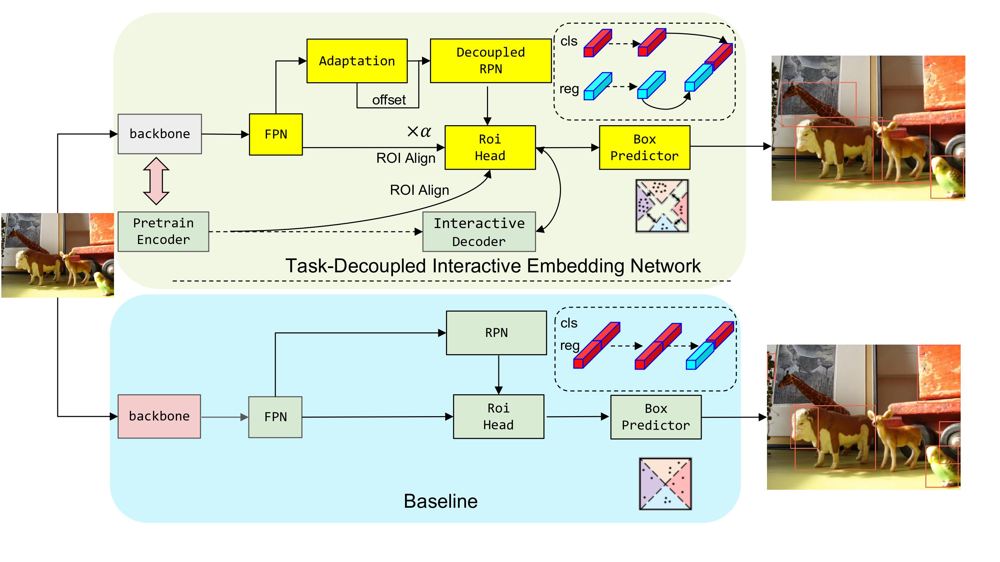

# DINet
> This is the official implementation of **Task-Decoupled Interactive Embedding Network for Object Detection**. 
## Introduction

Traditional object detection methods rely on manually annotated data, which can be costly and time-consuming, particularly for objects with low occurrence frequency or those that are neglected in existing datasets. When we need to generalize the model from the training datasets to the target datasets, false positive detection will appear with limited annotations in some categories and the model performance will decrease for unseen categories. In this paper, we found that the problems are related to the model's overfitting to foreground objects during the training stage and the inadequate robustness of feature representations. In order to effectively improve generalization of deep learning network, we propose a task-decoupled interactive embedding network. We decouple the sub-tasks in the detection pipeline with parallel convolution branches, with gradient propagation independently and anchor boxes generation from coarse to fine. And we introduce an embedding-interactive self-supervised decoder into the detector, so that the weaker object representations can be enhanced, and the representations of the same object can be closely aggregated, providing multi-scale semantic information for detection. Our method achieves great results on two visual tasks: few-shot object detection and open world object detection. It can effectively improve generalization on novel classes without hurting the detection of base classes and have good generalization ability for unknown categories detection. 

<p align="center"> </a> </p>

## Installation

### Pre-Requisites
You must have NVIDIA GPUs to run the codes.

The implementation codes are developed and tested with the following environment setups:
- Ubuntu LTS 18.04
- CUDA 11.1
- Python == 3.8
- PyTorch == 1.9.0+cu111, TorchVision == 0.10.0+cu111
- mmcv-full == 1.4.3
- fairscale, einops, mmpycocotools, tqdm, future, timm

### Data Preparation

#### MS-COCO for Open World Object Detection

Please download [COCO 2017 dataset](https://cocodataset.org/) and organize them as following:

```
code_root/
└── data/
    └── coco/                # MS-COCO dataset
        ├── train2017/
        ├── val2017/
        └── annotations/
            ├── instances_train2017.json
            └── instances_val2017.json
```
#### Pascal VOC for Few-Shot Object Detection

We use the train/val sets of PASCAL VOC 2007+2012 for training and the test set of PASCAL VOC 2007 for evaluation. We randomly split the 20 object classes into 15 base classes and 5 novel classes, and we consider 3 random splits. We transform the original Pascal VOC dataset format into MS-COCO format for parsing. The transformed Pascal VOC dataset is available for download at [GoogleDrive](https://drive.google.com/file/d/1u4OUGuHYr5VnBDHNZ4LMWV6g8To-YPHc/view?usp=share_link).


After downloading MS-COCO-style Pascal VOC, please organize them as following:

```
code_root/
└── data/
    └── voc/  
        ├── voc_fewshot_split1/     # VOC Few-shot dataset
        ├── voc_fewshot_split2/     # VOC Few-shot dataset
        ├── voc_fewshot_split3/     # VOC Few-shot dataset
        └── PascalVoc_CocoStyle/    # MS-COCO-Style Pascal VOC dataset
            ├── images/
            └── annotations/
                ├── xxxxx.json
                ├── yyyyy.json
                └── zzzzz.json
```

#### Pretrained Weight

The following table provides the pre-trained weight used in the paper:
<table><tbody>
<tr><td align="left">pre-trained weight</td>
<td align="center"><a href="https://drive.google.com/drive/folders/1y8HRAVFBX_xFvlgtp0r8Xqhq_Lv6Z6wr?usp=share_link">download</a></td>
</tr>
</tbody></table>

After downloading pre-trained weight, please organize them as following:
```
code_root/
└── trained_weights/
    └── xxx.pth/  
```

### Code Installation

First, clone the repository locally:
```shell
git clone https://github.com/hommelibrelm/DINet.git
```

We recommend you to use [Anaconda](https://www.anaconda.com/) to create a conda environment:
```bash
conda create --name dinet python=3.8 -y
```

Then, activate the environment:
```bash
conda activate dient
```

Then, install PyTorch and TorchVision:

(preferably using our recommended setups; CUDA version should match your own local environment)
```bash
conda install pytorch=1.9.0 torchvision=0.10.0 cudatoolkit=11.1 -c pytorch
```

After that, install other requirements:
```bash
pip install mmcv-full==1.4.3
pip install -r requirements.txt
cd few-shot-detection/open-world-detection
pip install -v -e .
```
### Evaluate

```bash
python tools/test.py "path_of_config/file.py" "work_dirs/trained_weights.pth" --eval bbox
```
### Train

```bash
python tools/train.py "path_of_config/file.py" 
```

We will provide official code here to reproduce the results:
- [x] few-shot-detection
- [X] open-world-detection
- [X] pretrained weight